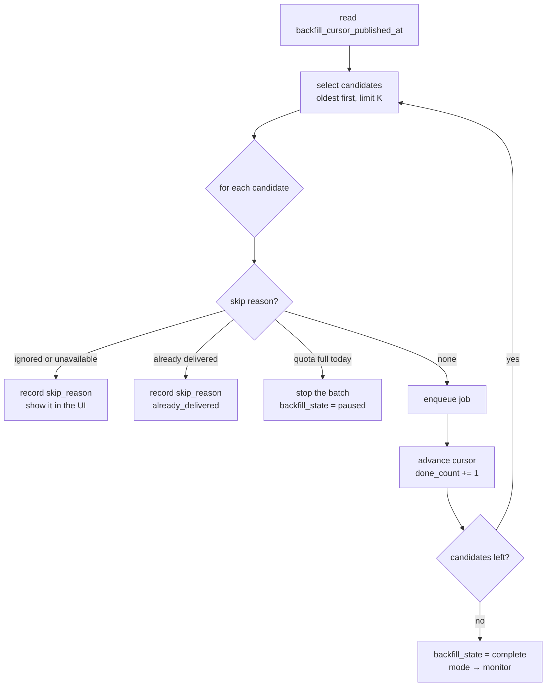
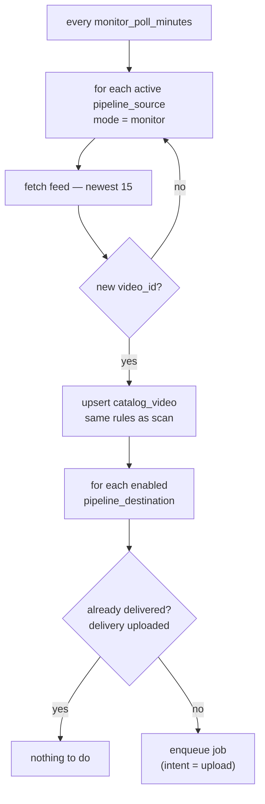
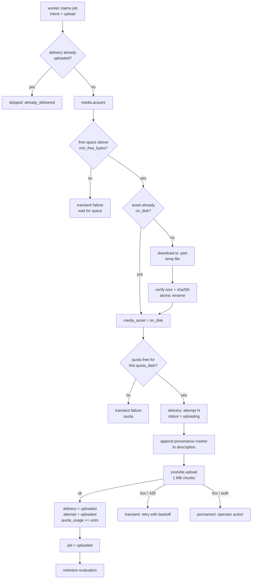
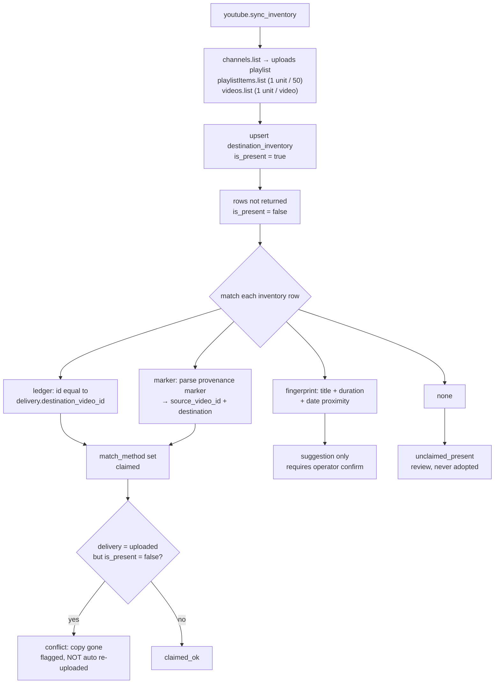
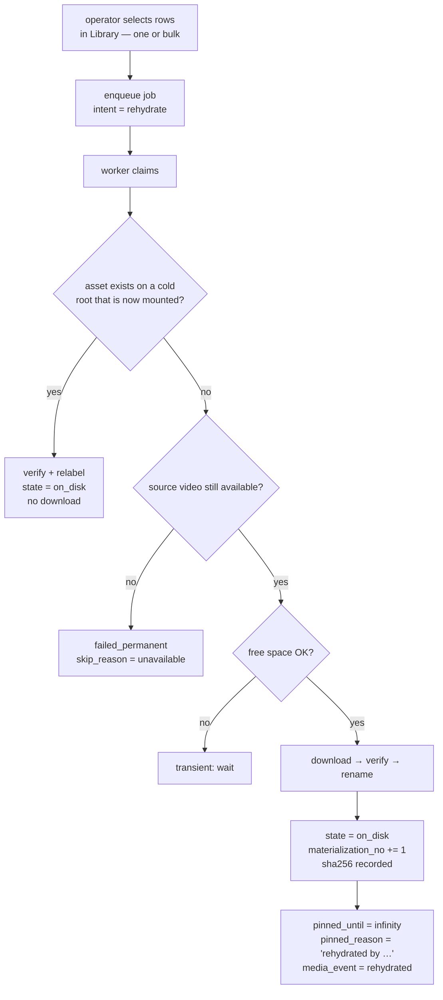
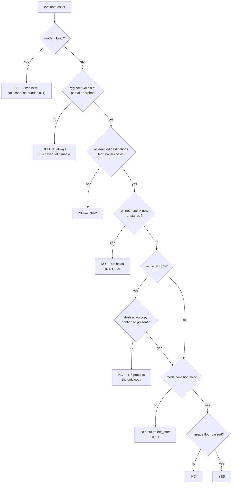

# 05 — Flows

**Project:** YT-Replicator · **Status:** Draft · **Depends on:** `02`, `03`, `04`

How work moves through the system. Every flow names the **module that owns it**,
so a diagram maps to exactly one work unit from `07_WORK_PLAN.md`. A flow is
only allowed to depend on the published interfaces listed in `04` §5.

**Conventions:** `→` is a step, `◇` is a decision, and **Guard** is the invariant
the flow must never break.

---

## 1. Scan a source · `sources`

Catalogues metadata. **Never downloads a byte** — INV-7.

```mermaid
flowchart TD
    A[operator adds a source] --> B{URL passes<br/>SSRF allow-list?}
    B -- no --> X[reject with reason]
    B -- yes --> C[resolve to external_id<br/>store url as typed]
    C --> D[yt-dlp extract_flat<br/>on the canonical URL]
    D --> E[upsert catalog_video<br/>per (source, video_id)]
    E --> F[rows not returned<br/>availability = unavailable]
    F --> G[recompute video_count<br/>scan_status = ok]
```

| Guard | Enforced by |
|---|---|
| No download ever happens here. | `sources.scan()` writes only `catalog_video`. No call into `media`. |
| Scanning twice changes nothing new. | `UNIQUE (source_id, video_id)` plus upsert. |
| Private or deleted videos never abort a scan. | `availability` is recorded; the batch continues. |

**Guard detail:** a channel URL is appended with `/videos` unless it already ends
in `/videos`, `/streams` or `/shorts`; `playlistend=None` and `ignoreerrors=True`
are set. yt-dlp returns newest first, so any oldest-first ordering is an explicit
reverse.

---

## 2. Hydrate · `sources`

Fills the expensive fields: description, tags, view and like counts, category.

```
1. select rows where hydrated_at IS NULL OR hydrated_at < now − 24 h
   ordered by published_at, limit batch
2. for each row: one yt-dlp call, single thread, sleep 1 s between calls
3. write the fields and hydrated_at
```

| Guard | Behaviour |
|---|---|
| Never blocks or delays scanning. | Separate batch, separate job intent. |
| Never refetches within 24 hours. | Filter on `hydrated_at`, backed by `catalog_video_hydrate_idx`. |
| Rate limits are respected, not tolerated. | The batch aborts and reschedules if a 429 was seen within 5 minutes. |

---

## 3. Backfill · `pipelines` owns the cursor, `worker` executes

**Precondition:** `pipeline.status = active` and
`pipeline_source.backfill_state = running`. Nothing starts automatically — an
operator activates the pipeline (D1).



| Guard | Enforced by |
|---|---|
| Resumable at any point, including after a crash. | The cursor is a timestamp; there is no list to rebuild. |
| Nothing already delivered is enqueued. | `delivery` check first, then the unique index (INV-5). The UI shows the reason. |
| Quota is never exceeded. | `quota_usage` for the current `quota_date` is checked *before* enqueueing. |
| Oldest first, always. | `ORDER BY published_at ASC` — explicitly reversed from yt-dlp's default. |

**Why a cursor and not a list:** the legacy stored `backfill_queue` as JSON,
which could be neither queried nor trusted and grew without bound (F-04, F-05).
A cursor is a single column, so resuming is free and correctness cannot drift.

---

## 4. Monitor · `sources` detects, `pipelines` decides, `jobs` queues



**Detection** reads the source feed only — the RSS endpoint when it suffices,
`extract_flat` otherwise. It costs one call per source per cycle and touches
neither `media` nor `youtube`.

**Two queues, two gates.** Detection enqueues optimistically; the **quota** and
**disk** gates are evaluated when a job is claimed, not when it is queued. This
keeps the queue an honest statement of "work we believe we owe", while the UI
shows *"queued — waiting for quota"* rather than pretending the work does not
exist.

| Guard | Behaviour |
|---|---|
| Detection can miss an upload. | A full reconciliation scan runs every `reconcile_hours` as the fallback (D9). This is why detection cadence is not load-bearing. |
| Two sources can show the same video. | Dedup is global on `(video_id, destination)`, so it is enqueued once. |
| A paused pipeline queues nothing. | `pipeline.status` is checked before `pipeline_source`. |

---

## 5. Deliver · `media` → `delivery` → `youtube`, orchestrated by `worker`

The end-to-end path, and the one where correctness matters most.



| Guard | Enforced by |
|---|---|
| A partial file is never uploaded (INV-3). | Download lands on `.part`; `verify` computes size and `sha256`; only then does an atomic rename make the asset `on_disk`. The upload path refuses anything else. |
| One current delivery per (video, destination) (INV-1). | `UNIQUE (workspace, source_video_id, destination_id)`, checked before insert. |
| The uploader records its own result. | `delivery` and `delivery_attempt` are written by the same code that performed the upload — no callback, no other process (fixes D-06). |
| A dashboard restart cannot lose an upload. | Same reason: there is no remote reporter to lose. |
| Transient and permanent failures are distinguishable. | Typed errors from `youtube` are classified in `jobs`; only `TransientError` is retried. |
| Disk never fills silently. | The admission check precedes any download and reports `NoStorageSpace` as a visible, retryable state. |

**Reused media:** if the asset is already `on_disk`, step C skips straight to D.
This is what makes a re-upload or a second pipeline's attempt free.

**Retention after success:** the asset is only released if `retention_decisions()`
allows it under §8 — default is `keep`, so by default nothing is deleted (D1).

---

## 6. Reconcile · `delivery` owns, `youtube` reads

This is the capability the legacy never had (D-13), and the reason "wipe
everything, re-add the source, check the destination" was impossible before.



| Outcome | Meaning | Action |
|---|---|---|
| `claimed_ok` | We uploaded it and it is still there. | None. This is the healthy majority. |
| `unclaimed_present` | Present on the destination with no delivery record. | Surface for review. **Never** auto-adopted (INV-8). |
| `missing_expected` | Delivery says uploaded, the destination no longer shows it. | Flag. The operator decides — the copy may have been deleted deliberately, for copyright or because it was a duplicate. |
| `marker_mismatch` | A marker points at a source video with no delivery row. | Flag for review; indicates history was lost or a marker was hand-written. |

| Guard | Rule |
|---|---|
| Reading inventory costs almost nothing. | `playlistItems.list` is 1 unit per 50 videos, `videos.list` is 1 per video; an upload is ~1 600. **Sync aggressively, upload carefully** — that asymmetry is the whole design. |
| Fuzzy matching never decides. | `fingerprint` produces a suggestion requiring confirmation. Only `ledger` and `marker` are exact. |
| Reconciliation never mutates history. | It writes `destination_inventory` and flags; it does not touch `delivery`. |
| Cadence. | Every `reconcile_hours` (6 h), and on demand from History. |

---

## 7. Rehydrate · `media`

Bringing a deleted file back, without re-uploading anything.



| Guard | Behaviour |
|---|---|
| Rehydrate never touches `delivery` or `jobs`' upload intent. | Same job table, different intent — no second downloader, no second queue (the rule from `00` P3). |
| A rehydrated file is never auto-deleted (D4). | Pinned on arrival with a reason; only an explicit release unpins it. |
| An offline archive that is now mounted costs nothing. | Detected before any download — this is the payoff for `archive_offline`. |
| Honest about non-recoverability. | If the source video is gone, the job ends `failed_permanent` with a reason the Library shows as *no surviving source*. |

---

## 8. Retention decision · `media`

One pure function, one owner (INV-10). It reads rows and returns a decision; it
never deletes anything itself. Called in **dry-run** by default for the audit
view.



| Mode | Condition (`keep` short-circuits before all of these) |
|---|---|
| `keep` | *Nothing, ever.* Evaluation returns immediately — no queries run. (D1) |
| `immediate` | Delete as soon as the gates above pass. |
| `after_n_jobs` | Fewer than **N newer completed jobs of the same pipeline** remain. Counts jobs, not uploads, so one video × two destinations is one bundle. (D5) |
| `after_hours` | `now − uploaded_at ≥ retention_hours`. |
| *(any mode)* | The **max-age backstop** `now − downloaded_at ≥ retention_backstop_days` forces deletion. (D6) |

**Gate order matters.** Hygiene runs first and is *not* retention — a partial
file is deleted whatever the policy says, always. Then the safety gates
(INV-2, pin, last-copy) which no mode may override. Then the mode condition.
Then the floors. Disk pressure may **shorten** the mode condition but may never
bypass the safety gates, the pin, or the min-age floor.

**Two-phase, always.** A decision writes `delete_after` and a
`delete_scheduled` media event; the executor deletes afterwards. Cancellable in
between, and auditable afterwards — `media_event` records who, when, why, and
how many bytes (P14).

---

## 9. Restart recovery · `jobs`, `worker`, `media`

Run once on worker start-up. Deterministic, idempotent, and auditable.

| Found | Action | Why |
|---|---|---|
| `claimed` with `claim_expires_at < now` | → `queued` | The claiming worker died. |
| `downloading` older than `claim_timeout` | → `queued`, partial `.part` discarded | Downloads do not run forever, and a partial file is never valid. |
| `uploading` older than `claim_timeout` | → `failed_transient`, reason `interrupted_during_upload` | **We do not know whether it succeeded.** |
| `media_asset` stuck in `downloading` | → `failed`, hygiene removes the partial | Prevents orphaned files. |
| `delivery` stuck in `uploading` | **Reconcile that destination first** | See below. |

The rule behind the last two rows: **after an interrupted upload, reconcile
before retrying.** Reconciling costs about one API unit; guessing costs a
duplicate upload. This is the behaviour the legacy could not have, because it had
nothing to reconcile against (D-13).

---

## 10. Pauses · scheduler state, not job state

When quota, disk or the operator stops work, `job.status` stays `queued`. States
describe the work, not the weather.

| Pause | Trigger | Cleared by | Queue shows |
|---|---|---|---|
| Quota | `units_used + 1650 > cap` for this `quota_date` | Next quota day (Pacific midnight) | *Paused — quota, resumes 04 Mar 00:00 PT* |
| Disk | `free_bytes < min_free_bytes` on every eligible root | Space freed or a root mounted | *Paused — 3.1 GB free, floor is 10 GB* |
| Operator | `pipeline.status = paused` or Queue pause | Operator | *Paused — operator* |
| Cold root only | asset lives on a detached root | Mount the root | *Waiting for archive drive* |

The worker re-evaluates these gates every time it claims, so recovery is
automatic and needs no wakeup mechanism. Because the pause is a scheduler
concern, no job row is mutated, no timestamps are rewritten, and the queue's
history stays truthful.

---

## 11. Error taxonomy · `jobs` classifies, the caller reacts

Every failure must land in exactly one of these three buckets.

| Error | Class | Retry | What the operator sees |
|---|---|---|---|
| Network / timeout | transient | exponential backoff with jitter | nothing, if it recovers |
| HTTP 5xx | transient | exponential backoff | last error after attempts are exhausted |
| HTTP 429 / quota exhausted | transient | resume at next `quota_date` | *Paused — quota* |
| Storage below floor | transient | gated, not failed | *Paused — disk* |
| Corrupt or partial file | transient | discard and re-download, bounded | attempt count |
| HTTP 401 / 403 — token revoked or wrong scope | **permanent** | no | *Reconnect channel* → Credentials |
| HTTP 400 — rejected upload parameters | **permanent** | no | error text on the job row |
| Source video unavailable or private | **permanent** | no | `skip_reason = unavailable` |
| Already delivered to this destination | **skip, not an error** | — | `already_delivered` |
| `interrupted_during_upload` | transient | reconcile first, then retry | *Verifying the previous attempt* |

`attempt_count` increments only for transient retries; after the configured
maximum the job becomes `failed_permanent` **with its last error preserved**, so
a human sees the real cause rather than "retry limit exceeded". Permanent
failures are never silently retried, and transient ones never fail silently —
this is the direct answer to the legacy's "marks a video as seen even if download
fails" (D-07).
