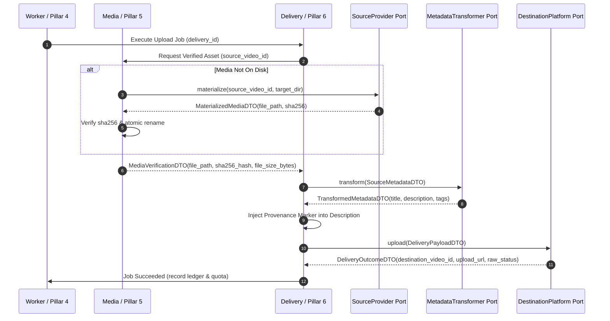

# 04 — Logic and Rules of Exchange

**Pillar:** 0 · Inter-Pillar Contracts · **Chapter:** Logic and Rules of Exchange · **Status:** `drafting`
**Depends on:** `docs/PILLARS/00_INTER_PILLAR_CONTRACTS/03_INTERFACE_CONTRACT.md` · `docs/00` §2, §5 · `docs/02` §4–§6 · `docs/04` §2–§5 · `docs/05` §1–§6
**Invariants touched:** INV-3, INV-4, INV-5, INV-7, INV-8, INV-9, INV-11, INV-12

---

## 1. Purpose

This chapter defines the governing logic and execution rules that bind the three
ports (`SourceProvider`, `DestinationPlatform`, `MetadataTransformer`) and their
frozen DTOs into the operational pipeline. It dictates identity translation,
call sequence validation, cross-pillar isolation, marker handling lifecycles, and
strict boundary guards.

It does **not** specify internal module algorithms (such as FFmpeg filter
graphs, yt-dlp parameter tuning, or PostgreSQL query plans). Those belong strictly
to Pillars 1, 2, 4, 5, and 6.

---

## 2. Universal Exchange Invariants (The Highway Rules)

Every operation crossing a Pillar 0 contract boundary must adhere to six
non-negotiable invariants (R1–R6, established in `03_INTERFACE_CONTRACT.md` §2):

| Rule | Statement | Architectural Purpose | Enforced By |
|---|---|---|---|
| **R1** | **Frozen Immutability** | All DTOs crossing ports are frozen dataclasses. Mutations in transit are impossible. | `dataclasses.dataclass(frozen=True)` |
| **R2** | **No DB Operations Across Ports** | A port method must never open a database session, start a transaction, or write rows. | Static analysis & boundary tests |
| **R3** | **Bounded Execution Time** | Every port call is wrapped in a hard timeout derived from `app_setting`. | Caller timeout wrapper |
| **R4** | **No Third-Party Leakage** | Google API client types, yt-dlp dicts, and HTTP response objects must never escape their adapter. | Adapter translation to DTOs |
| **R5** | **No Internal Retries** | An adapter must fail immediately with a typed error. Retries and backoff belong exclusively to the Job Engine (Pillar 4). | Adapter contract assertions |
| **R6** | **Deterministic Marker Management** | The platform adapter appends the provenance marker; the caller (Pillar 6) parses and reconciles it. | `PROVENANCE_MARKER_REGEX` |

---

## 3. Identity Resolution and Propagation Rules

A video's identity must remain completely unambiguous as it transitions across
sources, storage, transformation, and delivery.

```
External Source URL / ID
          │
          ▼  [SourceProvider.resolve()]
    ResolvedSource  ──► (canonical_url, channel_id, external_id)
          │
          ▼  [SourceProvider.scan() / hydrate()]
    CatalogVideoDTO ──► (source_ref, video_ref, title, published_at, duration_seconds)
          │
          ▼  [pipelines: matches pipeline_source & pipeline_destination]
    Delivery Intent ──► creates delivery row (status: pending, delivery_id assigned)
          │
          ▼  [media: materialize()]
    MediaVerificationDTO ──► (file_path, file_size_bytes, sha256_hash)
          │
          ▼  [delivery: DestinationPlatform.upload()]
    Provenance Marker ──► "[ref:{source_video_id}:{delivery_id}]" appended
          │
          ▼
    DestinationPlatform (external_id assigned by destination, e.g. YouTube video ID)
```

### 3.1 Identity Resolution Rules (ID-1 to ID-4)

- **RULE ID-1 (Canonical Source Identity):** A source URL must be resolved by
  `SourceProvider.resolve()` before any database persistence. The resulting
  `channel_id` or `playlist_id` becomes the permanent anchor. Sibling variants
  (e.g., `https://youtube.com/@handle`, `https://www.youtube.com/channel/UCxxx`,
  `https://youtube.com/c/custom`) must resolve to the identical `canonical_url`
  and `channel_id`.


---

## 4. Pipeline Execution & Exchange Lifecycle

The delivery of media follows a rigid state machine across ports. No step may
be skipped or executed out of sequence.



### 4.1 Sequence Validation Rules (SEQ-1 to SEQ-5)

- **RULE SEQ-1 (Media Pre-Condition):** `DestinationPlatform.upload()` must
  never be called until `MediaVerificationDTO` has confirmed:
  1. File exists at `media_path` and is readable.
  2. `file_size_bytes` is greater than 0 and matches actual disk bytes.
  3. `sha256_hash` matches the digest recorded during ingest.
- **RULE SEQ-2 (Transformation Boundary):** `MetadataTransformer.transform()`
  operates strictly on `SourceMetadataDTO` and must return a valid
  `TransformedMetadataDTO`.
  - In v1, the transformer is `PassthroughTransformer` (identity mapping).
  - The provenance marker is **never** passed into `transform()`; it is injected
    by Pillar 6 *after* transformation completes.
- **RULE SEQ-3 (Pre-Upload Quota Verification):** Prior to invoking
  `DestinationPlatform.upload()`, Pillar 6 must verify via `DestinationPlatform.check_quota()`
  that the quota bucket for the platform on the current UTC/Pacific day has


---

## 5. Provenance Marker Lifecycle & Disaster Recovery Rules

The marker `[ref:{source_video_id}:{delivery_id}]` is the bridge between the
internal database ledger and public platform state.

### 5.1 Marker Composition & Sanitation (MKR-1 to MKR-3)

- **RULE MKR-1 (Stripping Redundant Markers):** Before appending a provenance
  marker, any existing trailing marker matching `PROVENANCE_MARKER_REGEX`
  must be stripped from the source description. Markers must never accumulate
  or stack across successive uploads.
- **RULE MKR-2 (Length Safety):** Destination platforms enforce description length
  ceilings (e.g., YouTube: 5,000 characters). If appending the marker
  (`\n\n[ref:...:...]`, 32 characters) would cause the description to exceed the
  platform maximum:
  1. The description body is truncated at `(max_chars - 35)`.
  2. Trailing whitespace is trimmed.
  3. An ellipsis `...` is appended.
  4. The marker is appended at the terminal position.
  *The marker is NEVER truncated or omitted.*
- **RULE MKR-3 (Regex Conformance):** The marker must strictly match:
  ```regex
  \[ref:(?P<source_video_id>[A-Za-z0-9_-]{11}):(?P<delivery_id>\d+)\]$
  ```

### 5.2 Marker Recovery Logic (REC-1 to REC-3)

During a reconciliation sweep (`DestinationPlatform.list_inventory()`):
- **RULE REC-1 (Exact Match):** If the destination video description contains a
  marker whose `delivery_id` exists in the local database:
  - If `delivery.status == 'uploaded'`, state is validated (`reconciliation_ok`).
  - If `delivery.status == 'pending'` or `'uploading'`, state is updated to
    `uploaded` (recovering an interrupted upload whose worker died before DB update).
- **RULE REC-2 (Disaster Recovery - DB Loss):** If `delivery_id` does NOT exist in
  the database (e.g., fresh system installation after catastrophic loss):
  - The system checks if `source_video_id` exists in `catalog_video`.
  - A synthetic `delivery` row is created with state `claimed_recovered`.
  - The audit log records event `DELIVERY_RECOVERED_FROM_MARKER`.
- **RULE REC-3 (Unmarked Videos):** Videos found on the destination without a valid


---

## 6. Error Translation & Isolation Rules

Ports act as an impermeable error isolation firewall. Third-party library
exceptions are forbidden from crossing into the core domain.

```
Third-Party Layer           Port Adapter Boundary           Core Domain / Pillars
─────────────────           ─────────────────────           ─────────────────────
GoogleHttpError(403)   ──►  Adapter catches & maps   ──►    QuotaExhaustedError (transient)
yt_dlp.DownloadError   ──►  Adapter catches & maps   ──►    SourceUnavailableError (permanent)
httpx.ConnectTimeout   ──►  Adapter catches & maps   ──►    PlatformConnectionError (transient)
Any Unmapped Exception ──►  Adapter catches & maps   ──►    AdapterContractError (permanent)
```

### 6.1 Translation Invariants (ERR-1 to ERR-4)

- **RULE ERR-1 (Error Re-parenting):** All raised errors must inherit from
  `core.PillarError` (`03_INTERFACE_CONTRACT.md` §8).
- **RULE ERR-2 (Retry Classification):** Every error is unambiguously marked
  as either `is_retryable = True` (transient) or `is_retryable = False` (permanent).
  Pillar 4 relies exclusively on this attribute to determine retry behavior.
- **RULE ERR-3 (Third-Party Shielding):** Raw client exceptions (`googleapiclient.errors.HttpError`,
  `yt_dlp.utils.DownloadError`, etc.) must be captured within the adapter and
  re-raised as typed domain errors. The original exception is preserved strictly
  in Python's `__cause__` attribute for debugging.
- **RULE ERR-4 (Catch-All Safety Net):** Any unexpected exception not explicitly
  handled by the adapter must be wrapped in `AdapterContractError(is_retryable=False)`.
  This prevents bare unhandled exceptions from crashing the job runner.

---

## 7. Boundary Verification & Prohibited Interactions

To guarantee modularity, the following interactions are strictly forbidden and
checked during automated contract testing:

```
┌────────────────────────────────────────────────────────┐
│                   ILLEGAL INTERACTIONS                 │
├────────────────────────────────────────────────────────┤
│ ❌ Pillar 1 (Sources) calls Pillar 2 (Destinations)    │
│ ❌ Pillar 2 (Destinations) calls Pillar 5 (Media)      │
│ ❌ Pillar 5 (Media) imports DestinationPlatform Port   │
│ ❌ Pillar 0 DTOs import Django Models / SQLAlchemy     │
│ ❌ Any Port method opens a DB transaction             │
│ ❌ Port methods invoke internal retry loops            │
└────────────────────────────────────────────────────────┘
```

1. **No Lateral Pillar Calls:** Pillars 1, 2, and 5 must never call each other
   directly. All orchestration is mediated by Pillar 3 (Pipelines), Pillar 4 (Jobs),
   and Pillar 6 (Delivery).
2. **Framework Isolation:** DTOs and Protocols in Pillar 0 have zero dependencies
   on web frameworks, ORMs, or background task runners (Celery, Django, etc.).
3. **Stateless Adapters:** An adapter instance must remain completely stateless.
   It receives all necessary credentials and configuration in the call payload
   or initialization constructor, without persistent internal state between calls.

---

## 8. Deliberately Deferred to Future Pillars

- Specific retry backoff math (exponential vs. jittered) is owned by **Pillar 4 (`04_JOB_ENGINE`)**.
- Quota Pacific midnight reset calculations are owned by **Pillar 2 (`02_DESTINATIONS_AND_AUTH`)**.
- Video file path generation and hash verification algorithms are owned by **Pillar 5 (`05_MEDIA_AND_STORAGE`)**.
- Delivery state transitions and ledger database writes are owned by **Pillar 6 (`06_DELIVERY_AND_LEDGER`)**.

---

## 9. Open Questions

Open questions: none. All exchange rules derive directly from `docs/00`, `docs/04`,
and `docs/PILLARS/00_INTER_PILLAR_CONTRACTS/03_INTERFACE_CONTRACT.md`.

---

## 10. Change Log

- **2026-09-28:** Authored 04_LOGIC_AND_RULES.md defining exchange invariants R1-R6, identity propagation rules ID-1 to ID-4, lifecycle sequence rules SEQ-1 to SEQ-5, provenance marker rules MKR-1 to MKR-3 and REC-1 to REC-3, and error isolation rules.
