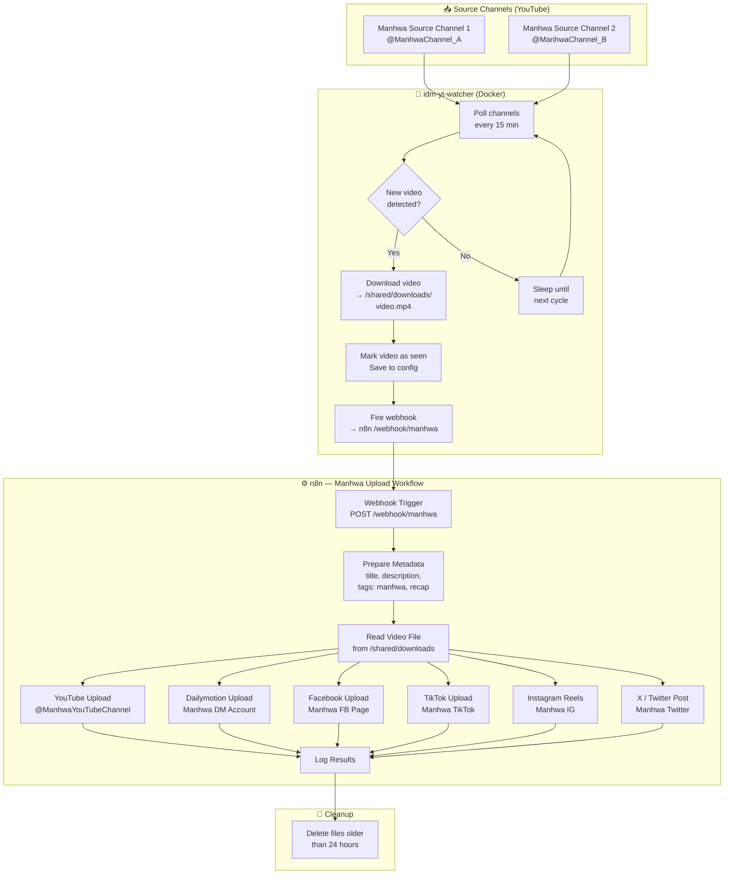
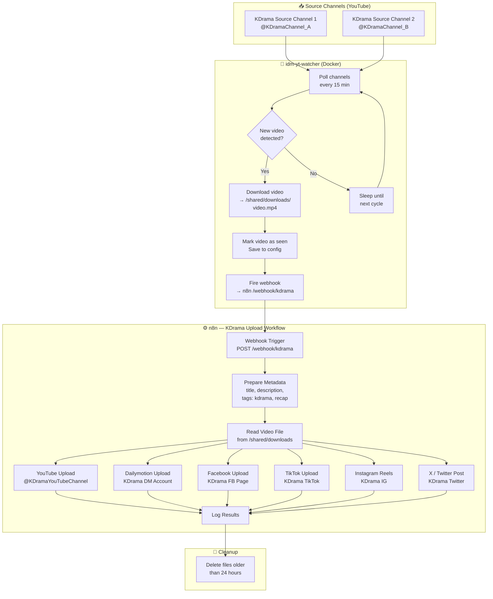
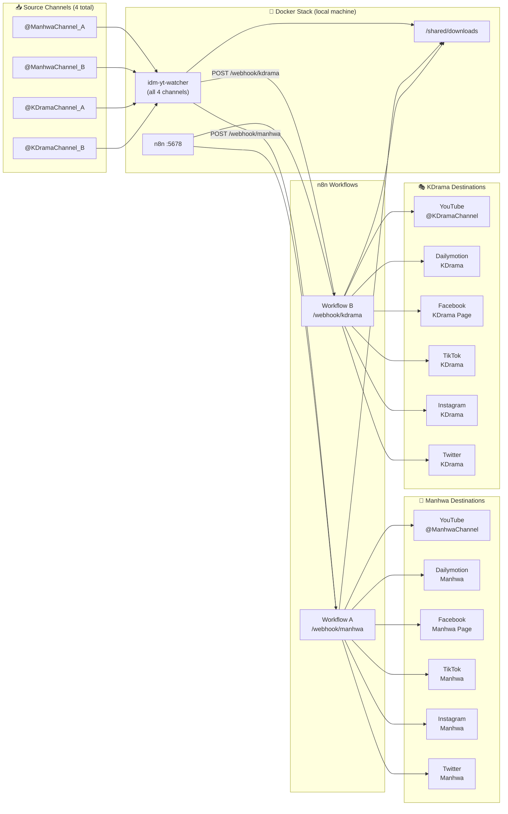

# Content Replication Blueprint
## Manhwa Recap & KDrama Recap — Full Workflow Documentation

**Last updated: April 18, 2026**

---

## 1. Overview

Two independent content pipelines run in parallel inside the same Docker stack.
Each niche has its own source channels, its own n8n workflow, and its own destination accounts.

```
┌──────────────────────────────────────────────────────────────────────────┐
│  idm-yt-watcher (single service, watches ALL 4 channels)                 │
│                                                                          │
│   ┌──────────────────────────┐   ┌──────────────────────────┐           │
│   │  MANHWA RECAP            │   │  KDRAMA RECAP             │           │
│   │  Source Channel 1        │   │  Source Channel 1         │           │
│   │  Source Channel 2        │   │  Source Channel 2         │           │
│   └────────────┬─────────────┘   └────────────┬──────────────┘           │
│                │ webhook A                     │ webhook B                │
└────────────────┼──────────────────────────────┼──────────────────────────┘
                 │                              │
                 ▼                              ▼
    ┌────────────────────────┐     ┌────────────────────────┐
    │  n8n Workflow A        │     │  n8n Workflow B        │
    │  "Manhwa Upload"       │     │  "KDrama Upload"       │
    │  /webhook/manhwa       │     │  /webhook/kdrama       │
    └────────────┬───────────┘     └────────────┬───────────┘
                 │                              │
        ┌────────┴────────┐           ┌─────────┴────────┐
        ▼                 ▼           ▼                   ▼
  [Manhwa Accounts]             [KDrama Accounts]
  YouTube Manhwa          YouTube KDrama
  Dailymotion Manhwa      Dailymotion KDrama
  Facebook Manhwa Page    Facebook KDrama Page
  TikTok Manhwa           TikTok KDrama
  Instagram Manhwa        Instagram KDrama
  Twitter Manhwa          Twitter KDrama
```

---

## 2. Manhwa Recap Pipeline

### 2.1 Flowchart



### 2.2 Channel Configuration

```json
// channel_monitor_config.json — Manhwa entries
{
  "channels": {
    "UC_manhwa_source_A": {
      "name": "Manhwa Source Channel 1",
      "url": "https://youtube.com/@ManhwaChannel_A",
      "auto_download": true,
      "videos_seen": [],
      "last_check": null
    },
    "UC_manhwa_source_B": {
      "name": "Manhwa Source Channel 2",
      "url": "https://youtube.com/@ManhwaChannel_B",
      "auto_download": true,
      "videos_seen": [],
      "last_check": null
    }
  }
}
```

### 2.3 Webhook Routing

```json
// n8n_webhook_config.json — Manhwa routing
{
  "channel_urls": {
    "UC_manhwa_source_A": "http://n8n:5678/webhook/manhwa",
    "UC_manhwa_source_B": "http://n8n:5678/webhook/manhwa"
  }
}
```

### 2.4 n8n Credential Set — Manhwa

| Platform | Credential Name (n8n) | Account |
|---|---|---|
| YouTube | `YouTube OAuth2 — Manhwa` | @ManhwaYouTubeChannel |
| Dailymotion | `Dailymotion OAuth2 — Manhwa` | Manhwa DM account |
| Facebook | `Facebook Graph API — Manhwa` | Manhwa Page token |
| TikTok | `TikTok OAuth2 — Manhwa` | Manhwa TikTok account |
| Instagram | `Instagram OAuth2 — Manhwa` | Manhwa IG account |
| X / Twitter | `Twitter OAuth2 — Manhwa` | Manhwa Twitter account |

---

## 3. KDrama Recap Pipeline

### 3.1 Flowchart



### 3.2 Channel Configuration

```json
// channel_monitor_config.json — KDrama entries
{
  "channels": {
    "UC_kdrama_source_A": {
      "name": "KDrama Source Channel 1",
      "url": "https://youtube.com/@KDramaChannel_A",
      "auto_download": true,
      "videos_seen": [],
      "last_check": null
    },
    "UC_kdrama_source_B": {
      "name": "KDrama Source Channel 2",
      "url": "https://youtube.com/@KDramaChannel_B",
      "auto_download": true,
      "videos_seen": [],
      "last_check": null
    }
  }
}
```

### 3.3 Webhook Routing

```json
// n8n_webhook_config.json — KDrama routing
{
  "channel_urls": {
    "UC_kdrama_source_A": "http://n8n:5678/webhook/kdrama",
    "UC_kdrama_source_B": "http://n8n:5678/webhook/kdrama"
  }
}
```

### 3.4 n8n Credential Set — KDrama

| Platform | Credential Name (n8n) | Account |
|---|---|---|
| YouTube | `YouTube OAuth2 — KDrama` | @KDramaYouTubeChannel |
| Dailymotion | `Dailymotion OAuth2 — KDrama` | KDrama DM account |
| Facebook | `Facebook Graph API — KDrama` | KDrama Page token |
| TikTok | `TikTok OAuth2 — KDrama` | KDrama TikTok account |
| Instagram | `Instagram OAuth2 — KDrama` | KDrama IG account |
| X / Twitter | `Twitter OAuth2 — KDrama` | KDrama Twitter account |

---

## 4. Combined System Map



---

## 5. Complete Config File (Both Niches)

```json
// channel_monitor_config.json
{
  "channels": {
    "UC_manhwa_source_A": {
      "name": "Manhwa Source Channel 1",
      "url": "https://youtube.com/@ManhwaChannel_A",
      "auto_download": true,
      "videos_seen": [],
      "last_check": null
    },
    "UC_manhwa_source_B": {
      "name": "Manhwa Source Channel 2",
      "url": "https://youtube.com/@ManhwaChannel_B",
      "auto_download": true,
      "videos_seen": [],
      "last_check": null
    },
    "UC_kdrama_source_A": {
      "name": "KDrama Source Channel 1",
      "url": "https://youtube.com/@KDramaChannel_A",
      "auto_download": true,
      "videos_seen": [],
      "last_check": null
    },
    "UC_kdrama_source_B": {
      "name": "KDrama Source Channel 2",
      "url": "https://youtube.com/@KDramaChannel_B",
      "auto_download": true,
      "videos_seen": [],
      "last_check": null
    }
  }
}
```

```json
// n8n_webhook_config.json
{
  "global_url": "",
  "enabled": true,
  "channel_urls": {
    "UC_manhwa_source_A": "http://n8n:5678/webhook/manhwa",
    "UC_manhwa_source_B": "http://n8n:5678/webhook/manhwa",
    "UC_kdrama_source_A": "http://n8n:5678/webhook/kdrama",
    "UC_kdrama_source_B": "http://n8n:5678/webhook/kdrama"
  }
}
```

---

## 6. n8n Setup Checklist

### Workflows to create (2 total)
- [ ] Import `n8n_workflow.json` → rename to **"Manhwa Upload"** → set webhook path to `manhwa`
- [ ] Duplicate workflow → rename to **"KDrama Upload"** → set webhook path to `kdrama`

### Credentials to create in n8n (12 total — 6 per niche)

**Manhwa set:**
- [ ] YouTube OAuth2 — Manhwa
- [ ] Dailymotion OAuth2 — Manhwa
- [ ] Facebook Graph API — Manhwa
- [ ] TikTok OAuth2 — Manhwa
- [ ] Instagram OAuth2 — Manhwa
- [ ] Twitter OAuth2 — Manhwa

**KDrama set:**
- [ ] YouTube OAuth2 — KDrama
- [ ] Dailymotion OAuth2 — KDrama
- [ ] Facebook Graph API — KDrama
- [ ] TikTok OAuth2 — KDrama
- [ ] Instagram OAuth2 — KDrama
- [ ] Twitter OAuth2 — KDrama

---

## 7. What Happens Step by Step (Example)

```
14:00  watcher wakes up
       checks @ManhwaChannel_A  → 2 new videos found
       checks @ManhwaChannel_B  → 0 new videos
       checks @KDramaChannel_A  → 1 new video found
       checks @KDramaChannel_B  → 0 new videos

14:01  downloads Manhwa video 1 → /shared/downloads/Title_1.mp4
       fires POST → http://n8n:5678/webhook/manhwa
       n8n uploads Title_1.mp4 to all 6 Manhwa accounts

14:04  downloads Manhwa video 2 → /shared/downloads/Title_2.mp4
       fires POST → http://n8n:5678/webhook/manhwa
       n8n uploads Title_2.mp4 to all 6 Manhwa accounts

14:07  downloads KDrama video 1 → /shared/downloads/Title_3.mp4
       fires POST → http://n8n:5678/webhook/kdrama
       n8n uploads Title_3.mp4 to all 6 KDrama accounts

14:10  all downloads complete
       watcher saves updated videos_seen lists to config
       watcher sleeps 15 minutes

14:25  next cycle begins...

38:00  cleanup runs: deletes files older than 24h
```

---

## 8. Next Steps

| Step | Action | Who |
|---|---|---|
| 1 | Replace placeholder channel IDs/URLs with real ones in config | You |
| 2 | `docker compose up -d --build` | You |
| 3 | Import `n8n_workflow.json`, duplicate for KDrama | You (n8n UI) |
| 4 | Create 12 credentials in n8n (one per platform per niche) | You (n8n UI) |
| 5 | Activate both workflows | You (n8n UI) |
| 6 | Monitor first cycle with `docker compose logs -f watcher` | You |
| 7 | Build local dashboard UI (Phase 4) | To be built |
