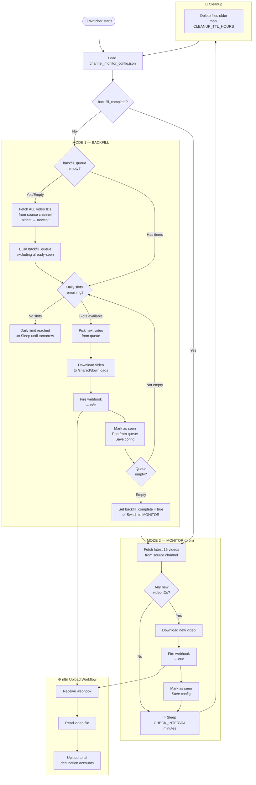

# Phase 1 — Single Channel Replication with Daily Upload Limit
## Workflow Blueprint

---

## The Two-Mode Design

Every channel goes through exactly two sequential modes, automatically:

```
First start
    │
    ▼
┌─────────────────────────────────────────────────────┐
│  MODE 1 — BACKFILL                                  │
│                                                     │
│  Goal: upload the ENTIRE existing video history     │
│  of the source channel to all destination accounts  │
│                                                     │
│  Rate: up to DAILY_UPLOAD_LIMIT per day (default 10)│
│  Order: oldest video first → newest video last      │
│  Resume: picks up where it left off every day       │
└────────────────────┬────────────────────────────────┘
                     │  queue empty
                     ▼
┌─────────────────────────────────────────────────────┐
│  MODE 2 — MONITOR (cron)                            │
│                                                     │
│  Goal: detect NEW uploads as they appear            │
│                                                     │
│  Frequency: every CHECK_INTERVAL minutes (15 min)   │
│  Fetches: only the latest 15 videos (fast)          │
│  Downloads: only videos not yet in videos_seen list  │
└─────────────────────────────────────────────────────┘
```

---

## Flowchart — Full Lifecycle



---

## Real-World Example Timeline

Assume source channel has **50 videos**, daily limit = **10**.

```
DAY 1
  09:00  Watcher starts
  09:01  Fetches full channel history: 50 videos found
  09:01  Builds backfill_queue: [vid_001, vid_002, ..., vid_050]
  09:02  Processes vid_001 → download → webhook → n8n uploads to all platforms
  09:15  Processes vid_002 → download → webhook → n8n uploads
  09:28  ...
  12:30  Processes vid_010 → daily limit reached
  12:31  Sleeps until next cycle (15 min), skips remaining 40 videos
  (all cycles for the rest of Day 1 skip this channel — limit reached)

DAY 2
  00:00  Midnight: daily counter resets (uploads_today = 0)
  00:15  Watcher cycles, resumes from vid_011
  03:00  Processes vid_011 → vid_020 → limit reached again

DAY 3
  00:15  Resumes from vid_021 → vid_030

DAY 4
  00:15  Resumes from vid_031 → vid_040

DAY 5
  00:15  Resumes from vid_041 → vid_050
  Processes vid_050 → queue empty
  ✅ BACKFILL COMPLETE — switches to MONITOR mode

DAY 5+ (ongoing)
  Every 15 minutes: checks for new uploads
  If source channel posts a new video → downloaded and distributed within 15 min
```

---

## Config Fields Reference

```json
{
  "channels": {
    "UCxxxxxxxxxxxxxxxxxx": {
      "name": "Source Channel Name",
      "url": "https://youtube.com/@SourceChannel",
      "auto_download": true,

      // Mode tracking (auto-managed, do not edit manually)
      "backfill_complete": false,
      "backfill_queue": [],
      "backfill_entry_map": {},

      // Daily limit (override per-channel, or set DAILY_UPLOAD_LIMIT env var)
      "daily_upload_limit": 10,
      "uploads_today": 0,
      "uploads_today_date": "2026-04-18",

      // All processed video IDs (backfill + monitor)
      "videos_seen": [],
      "last_check": null
    }
  }
}
```

---

## Environment Variables

| Variable | Default | Description |
|---|---|---|
| `DAILY_UPLOAD_LIMIT` | `10` | Max uploads per channel per day |
| `CHECK_INTERVAL` | `15` | Minutes between monitor-mode polls |
| `CLEANUP_TTL_HOURS` | `24` | Hours before temp files are deleted |
| `N8N_WEBHOOK_URL` | `""` | Global fallback n8n webhook URL |

Set per-channel override in config:
```json
"daily_upload_limit": 5
```

---

## YouTube Daily Quota — Why 10?

YouTube Data API v3 gives **10,000 units/day** for free.

| Action | Cost |
|---|---|
| Video upload | ~1,600 units |
| Set metadata/thumbnail | ~50 units |
| **Total per video** | **~1,650 units** |
| **Safe daily uploads** | **~6 videos** (conservative) |
| With quota increase | Up to 50+ (request via Google Cloud) |

**Recommendation:** Start with `DAILY_UPLOAD_LIMIT=6` for safety, request a quota increase, then raise to 10.

---

## How to Skip Backfill (Start Fresh)

If you do NOT want to replicate old content and only want future videos:

```json
{
  "channels": {
    "UCxxxxxxxxxx": {
      "backfill_complete": true,
      "videos_seen": []
    }
  }
}
```

Setting `backfill_complete: true` from the start jumps directly to monitor mode.
